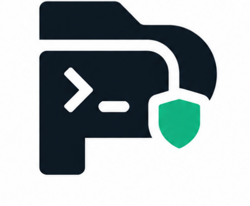
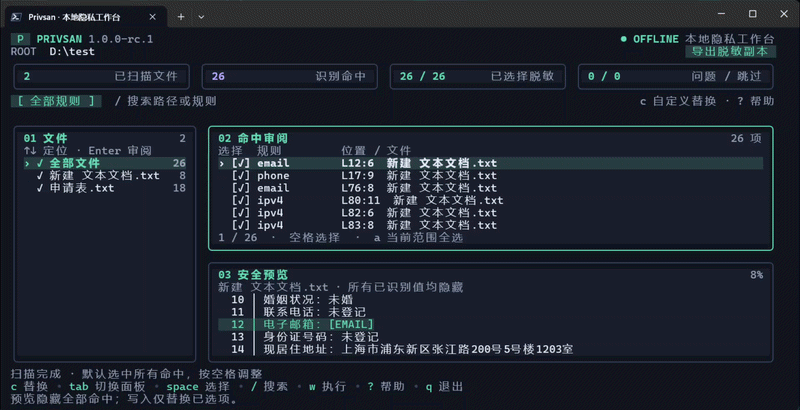

<div align="center">

<h1 align="center">&nbsp;Privsan</h1>

### 敏感数据留在本地，只分享你选择的内容。

本地文件脱敏与自定义文本替换 CLI，配备交互式终端界面。

[](LICENSE)
[](go.mod)
[](#隐私边界)
[](#项目状态)

[快速开始](#快速开始) · [使用流程](#使用流程) · [Agent 接入](#ai-agent-接入) · [完整参考](docs/CLI.md) · [English](README.md)

</div>

---

在日志、文档和测试数据离开本机之前，先用 Privsan 扫描和脱敏。预览命中位置，通过 [Bubble Tea](https://github.com/charmbracelet/bubbletea) TUI 逐项审阅，然后导出脱敏副本，或在创建备份后修改原文件。

**不上传文件，无遥测，无需账户。扫描默认只读。**

```text
contact=alice@example.com  phone=13800138000  source=192.0.2.1
                              ↓
contact=[EMAIL]           phone=[PHONE]     source=[IP]
```

> [!IMPORTANT]
> 本工具仅作辅助，不能作为安全审计的唯一方案。正则可能误报、漏报，请检查结果后再分享数据。

## 核心能力

- **本地处理**：扫描和替换均在本机完成。
- **先预览再操作**：查看规则、行列和命中位置，原文件保持不变。
- **交互式审阅**：逐项选择，按文件或规则筛选，查看脱敏行预览。
- **可恢复写入**：导出新目录，或使用经过校验的备份进行原地修改和恢复。
- **Agent 友好**：JSON、JSONL、标准输入与输出；扫描不完整时不输出正文。
- **自定义替换**：原文查找、可选正则与忽略大小写，支持单文件或批量替换、空值删除。
- **可配置策略**：自定义 RE2 规则、规则开关、固定掩码、HMAC 稳定伪名。

## 快速开始

在仓库根目录构建，需要 **Go 1.26.5+**；`go.mod` 指定构建工具链 Go 1.27.1。

```powershell
go build -trimpath -o privsan.exe .

# 扫描仓库中的合成示例，不修改文件。
.\privsan.exe scan .\examples

# 以只读模式进入交互界面。
.\privsan.exe tui --dry-run .\examples
```

Linux / macOS：

```sh
go build -trimpath -o privsan .
./privsan scan ./examples
./privsan tui --dry-run ./examples
```

首次源码构建可能下载工具链和依赖；编译后的可执行文件离线运行，目标机器无需安装 Go。所有参数放在路径之前，每次接收一个文件或目录根路径。运行 `privsan help` 查看完整帮助。

## 使用流程

### 扫描与审阅

```powershell
.\privsan.exe scan .\documents
.\privsan.exe scan --include '**/*.log' --exclude '**/generated/**' .\documents
.\privsan.exe tui .\documents
```



目录会递归扫描。省略子命令等同于 `scan`，省略路径则扫描当前目录。可用 `.privsanignore` 保存排除规则，语法独立于 `.gitignore`。

| 按键 | 操作 |
|:---|:---|
| `Tab` / `Shift+Tab` | 切换文件、命中和预览面板 |
| `↑` / `↓`、`j` / `k`、`PgUp` / `PgDn` | 在当前面板导航 |
| `Space` | 切换当前命中，或当前文件筛选范围内的命中 |
| `/`、`[` / `]`、`Esc` | 实时搜索、切换规则、清除筛选 |
| `a` | 全选或取消当前范围内的命中 |
| `←` / `→`、`h` / `l` | 聚焦预览后水平滚动 |
| `o` / `d` | 设置输入路径 / 导出目录 |
| `f` / `Enter` | 聚焦文件面板 / 审阅选中文件的命中 |
| `c` / `Ctrl+D` | 打开自定义替换表单 / 返回隐私脱敏 |
| `w` | 审阅并确认执行 |
| `e` / `?` / `q` | 查看结果与诊断 / 帮助 / 退出 |

工作台提供文件导航、命中选择、可滚动的脱敏预览和扫描统计，适配窄窗口及终端明暗背景。预览始终屏蔽所有已识别值，包括未勾选项；勾选状态影响实际替换。

按 `w` 审阅写入摘要，默认选中**取消**；`Tab` 切换操作，`Enter` 确定，`y` 明确执行。导出目录输错时，可在**确认窗口内按 `d` 修改目录**，用方向键、`Home` / `End` 定位，`Backspace` 删除。`Enter` 更新目录并返回新的确认摘要，`Esc` 保留原目录；返回时都重新选中“取消”。`--dry-run` 始终禁止写入。

最小终端大小为 48 列 × 15 行，推荐 120 × 30 或更大。范围选择、确认和取消操作见 [TUI 使用指南](docs/TUI.md)。

### 导出脱敏副本

```powershell
.\privsan.exe redact --output .\sanitized\batch-001 .\documents
```

目标必须是**输入根目录之外、尚不存在的新目录**。支持且未被排除的文件会按相对目录结构导出。成功结果包含 `.privsan-export.json`；退出码非零或缺少完成标记时，不应消费该目录。

### 修改原文件与恢复

```powershell
.\privsan.exe redact --in-place --backup-dir .\backups .\documents

# 使用操作结果返回的实际备份运行目录。
.\privsan.exe restore --from .\backups\run-... --root .\documents
```

原地修改必须指定输入根之外的备份目录。程序先检查全部来源并落盘校验备份，再逐文件提交；恢复时拒绝覆盖脱敏后又被编辑的文件。

> [!NOTE]
> 备份包含原始敏感内容，应保存在受控目录。批次按文件提交，不是整个目录的原子事务。`--dry-run` 可禁止全部写入。

## 自定义查找替换

```powershell
.\privsan.exe replace --find '旧项目名称' --with '新项目名称' --dry-run .\documents
.\privsan.exe replace --find '旧项目名称' --with '新项目名称' --output ..\replaced-copy .\documents

# 可选正则与忽略大小写。
.\privsan.exe replace --find 'build-[0-9]+' --with 'build-current' --regex --ignore-case --dry-run .\documents

# 显式传入空替换值，删除命中的文本。
.\privsan.exe replace --find '临时备注' --with= --dry-run .\notes.txt
```

TUI 按 `f` 选择文件，再按 `c` 打开“查找 / 替换为”表单，默认只处理该文件；从“全部文件”范围打开表单则默认批量处理。填写后按 `Enter` 生成预览，用空格逐项选择，`d` 设置新导出目录，`w` 审阅并确认写入。`Esc` 取消表单，不改变当前计划。

| 表单按键 | 操作 |
|:---|:---|
| `Tab` / `Shift+Tab` | 切换查找与替换输入框 |
| `Ctrl+S` | 切换当前文件 / 全部文件（有可用文件时） |
| `Ctrl+R` | 切换原文 / Go 正则查找 |
| `Ctrl+G` | 切换区分 / 忽略大小写 |
| `Enter` / `Esc` | 生成预览 / 取消草稿 |

主界面 `Ctrl+D` 返回隐私脱敏。提交新计划会重新生成命中并默认全选。默认按原文、区分大小写查找，可选 `--regex` / `--ignore-case`；替换值始终按字面量处理，不展开 `$1`，也不把 `\n` 转成换行。空替换值删除命中。TUI 接受单行输入，实际换行或制表符请使用 CLI。默认单文件 **16 MiB**、批次 **128 MiB**，替换扩张同样受限。

**自定义替换不会自动脱敏。** TUI 预览展示全部替换候选，并隐藏已识别隐私；实际输出只执行选中的自定义替换，预览隐私掩码不会写入文件。`replace --content` / `--stdout` 仍可能保留敏感数据，Agent 脱敏流程应使用 `scan` / `redact`。[完整替换说明](docs/CLI.md#custom-find-and-replace)。

## AI Agent 接入

在可信本地进程中，先脱敏再让 Agent 读取：

```powershell
.\privsan.exe scan --json --content --hide-paths .\documents
```

`--json` 默认只有元数据；`--content` 显式请求脱敏正文。必须先检查进程退出码和 `complete: true`，再只读取 `files[].content`。任何扫描或操作未完整成功时，整批正文都不会输出。

`--hide-paths` 隐藏报告路径；`--jsonl` 按文件输出记录，最后包含 summary，消费者必须验证尾记录和退出码。文本管道可用 `redact --stdin --stdout`。文件读取优先传路径，避免旧版 PowerShell 管道改变字节编码或换行。

[完整 JSON 契约 →](docs/CLI.md#json-report-v2)

## 支持的数据

支持 UTF-8 的 `.md`、`.txt`、`.csv`、`.log`，含 UTF-8 BOM；保留未匹配字节和换行。

| 类型 | 范围 | 默认替换 |
|:---|:---|:---|
| 手机号 | 中国大陆手机，可带国家码和常见分隔符 | `[PHONE]` |
| 邮箱 | 常见 ASCII 邮箱 | `[EMAIL]` |
| 身份证 | 18 位候选，可开启日期和校验位验证 | `[ID]` |
| IP | 合法 IPv4 / IPv6，含 IPv6 zone 后缀 | `[IP]` |

CSV 按文本处理，跨越分隔符、引号和换行的命中会报错；自定义替换也不能向 CSV 插入逗号、分号、引号或换行。国际手机号、Unicode / 引号邮箱、Office / PDF、图片识别暂不在支持范围内。

## 自定义规则

```powershell
.\privsan.exe config init --output policy.json
.\privsan.exe config validate --config policy.json
.\privsan.exe scan --config policy.json .\documents
```

在策略的 `rules` 数组中添加：

```json
{
  "id": "api_token",
  "pattern": "sk-[A-Za-z0-9]{12,}",
  "replacement": "[TOKEN]",
  "priority": 200
}
```

替换值是字面量，不展开 `$1`。内置策略支持类型占位符、固定 `[REDACTED]` 和通过环境变量提供密钥的 HMAC 伪名。

[完整示例](privsan.example.json) · [策略参考](docs/CLI.md#policy-v1) · [配置 Schema](docs/policy.schema.json)

## 隐私边界

运行时没有上传、遥测、远程规则加载或联网激活。元数据报告不包含匹配原文或自定义查找查询；终端内容预览隐藏已识别隐私。自定义替换的实际输出遵循上文的独立说明。

未识别内容、文件名和路径仍可能敏感，脱敏不等于匿名化或合规认证。操作期间保持源目录静止；备份未加密。详细边界见 [安全说明](SECURITY.md)。

默认单文件 **16 MiB**、总输入 **128 MiB**、**10,000 个文件**、**100,000 个命中**，最多 **4 个并发读取 worker**。超限会报错，不会静默截断后返回成功。

## 文档与贡献

- [CLI 与配置参考](docs/CLI.md)：命令、规则、筛选、JSON 与退出码。
- [操作与恢复手册](docs/OPERATIONS.md)：恢复和故障处理。
- [贡献指南](CONTRIBUTING.md)：本地验证与提交要求。
- [更新记录](CHANGELOG.md)。

```sh
go test ./...
go vet ./...
```

问题反馈和测试请使用合成数据，不要附上真实个人信息、密钥或原文备份。

## 项目状态

**1.0.0-rc.1：发布候选。** 构建目标包括 Windows amd64、Linux amd64/arm64、macOS amd64/arm64。交叉编译不代表原生运行验收；仓库包含三平台 CI 工作流。

## 许可证

本项目采用 [MIT License](LICENSE)。第三方依赖的许可说明见 [NOTICE.md](NOTICE.md)。
